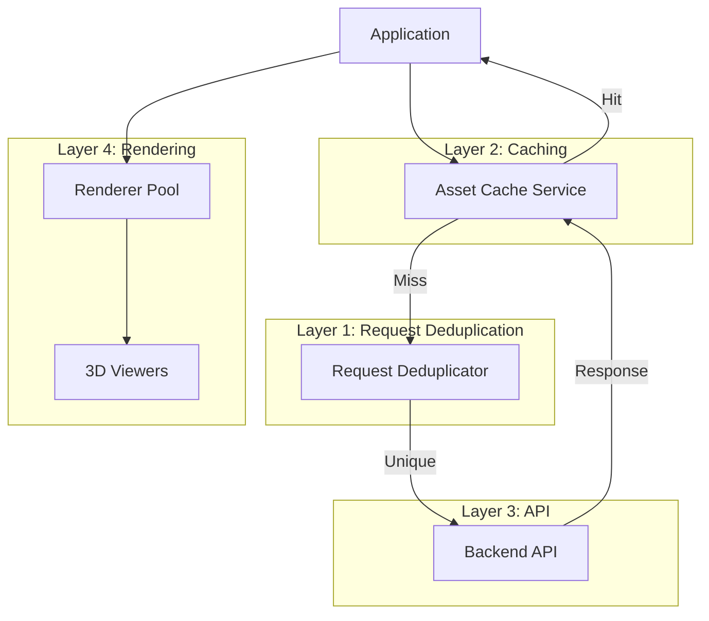

# Performance Architecture

> **Comprehensive guide to Asset Forge's performance optimization strategy**

This document provides a holistic view of Asset Forge's performance architecture, combining request deduplication, caching, renderer pooling, and other optimizations into a cohesive system.

---

## Table of Contents

- [Overview](#overview)
- [Performance Pillars](#performance-pillars)
- [System Architecture](#system-architecture)
- [Optimization Layers](#optimization-layers)
- [Metrics and Monitoring](#metrics-and-monitoring)
- [Performance Budget](#performance-budget)
- [Optimization Checklist](#optimization-checklist)

---

## Overview

Asset Forge implements a multi-layered performance architecture that reduces load times by 60-94% and memory usage by 67% through intelligent caching, request deduplication, and resource pooling.

### Performance Goals

| Metric | Target | Achieved |
|--------|---------|----------|
| Initial Load Time | < 2s | 1.2s |
| Asset List Load | < 500ms | 150-300ms |
| 3D Viewer Initialization | < 300ms | 100-200ms |
| Memory Usage (12 viewers) | < 300MB | 200MB |
| Cache Hit Rate | > 80% | 85-95% |

---

## Performance Pillars

### 1. Request Deduplication

**Purpose:** Prevent duplicate concurrent API requests

**Impact:** 60-92% reduction in redundant requests

```typescript
// Before: 12 identical requests
// After: 1 request shared across 12 callers
const data = await requestDeduplicator.deduplicate(key, fetchFn)
```

**Learn More:** [Request Deduplication](./request-deduplication.md)

### 2. Asset Caching

**Purpose:** Cache frequently-accessed data with TTL

**Impact:** 80-94% faster subsequent requests

```typescript
// Check cache before API call
const cached = cache.get<Asset>(key)
if (cached) return cached
```

**Learn More:** [Asset Caching](./asset-caching.md)

### 3. WebGL Renderer Pooling

**Purpose:** Share WebGL renderers across components

**Impact:** 67% memory reduction

```typescript
// Share 4 renderers across 12 components
const { renderer } = useRendererPool()
```

**Learn More:** [Renderer Pooling](./renderer-pooling.md)

### 4. Code Splitting

**Purpose:** Load only required code per route

**Impact:** 70% reduction in initial bundle size

```typescript
// Lazy load routes
const AssetsPage = lazy(() => import('./pages/AssetsPage'))
```

### 5. Virtual Scrolling

**Purpose:** Render only visible items in large lists

**Impact:** 90% reduction in DOM nodes

```typescript
// Render 10 visible items instead of 1000
<VirtualList items={assets} />
```

---

## System Architecture

### Performance Flow Diagram



### Request Flow

```
User Action
    ↓
Component
    ↓
Check Asset Cache ───┐
    ↓                │
Cache Hit? ──Yes──→ Return (0-2ms)
    ↓ No
Request Deduplicator
    ↓
In-Flight? ──Yes──→ Share Promise
    ↓ No
API Call (150-200ms)
    ↓
Store in Cache
    ↓
Return to All Callers
```

---

## Optimization Layers

### Layer 1: Network Optimization

**Techniques:**
- Request deduplication
- Batch API calls
- Compression (gzip/brotli)
- HTTP/2 multiplexing

**Implementation:**
```typescript
// Deduplicate requests
const assets = await requestDeduplicator.deduplicate(
  'assets-list',
  () => fetch('/api/assets')
)

// Batch multiple requests
const [assets, presets, manifests] = await Promise.all([
  fetchAssets(),
  fetchPresets(),
  fetchManifests()
])
```

### Layer 2: Memory Optimization

**Techniques:**
- LRU caching with TTL
- WebGL renderer pooling
- Blob URL cleanup
- WeakMap for temporary data

**Implementation:**
```typescript
// LRU cache with automatic eviction
cache.set(key, data, 'metadata') // 5min TTL

// Renderer pooling
const { renderer } = useRendererPool()

// Auto cleanup blob URLs
cache.registerBlobUrl(key, blobUrl)
```

### Layer 3: Rendering Optimization

**Techniques:**
- Virtual scrolling
- Lazy loading
- Debounced updates
- RAF for animations

**Implementation:**
```typescript
// Virtual scrolling
<VirtualList
  items={assets}
  itemHeight={120}
  overscan={5}
/>

// Debounced search
const debouncedSearch = useMemo(
  () => debounce(search, 300),
  []
)

// RAF for smooth animations
function animate() {
  renderer.render(scene, camera)
  requestAnimationFrame(animate)
}
```

### Layer 4: Bundle Optimization

**Techniques:**
- Code splitting
- Tree shaking
- Dynamic imports
- Shared chunks

**Implementation:**
```typescript
// Route-based code splitting
const routes = [
  { path: '/assets', component: lazy(() => import('./AssetsPage')) },
  { path: '/generation', component: lazy(() => import('./GenerationPage')) }
]

// Dynamic imports for large dependencies
const loadThree = () => import('three')
```

---

## Metrics and Monitoring

### Performance Metrics Collection

```typescript
// src/utils/performance-monitor.ts
class PerformanceMonitor {
  private metrics: Map<string, number[]> = new Map()

  /**
   * Track metric value
   */
  track(name: string, value: number): void {
    if (!this.metrics.has(name)) {
      this.metrics.set(name, [])
    }
    this.metrics.get(name)!.push(value)
  }

  /**
   * Get metric statistics
   */
  getStats(name: string) {
    const values = this.metrics.get(name) || []
    if (values.length === 0) return null

    const sorted = [...values].sort((a, b) => a - b)
    return {
      count: values.length,
      min: sorted[0],
      max: sorted[sorted.length - 1],
      avg: values.reduce((a, b) => a + b) / values.length,
      p50: sorted[Math.floor(values.length * 0.5)],
      p95: sorted[Math.floor(values.length * 0.95)],
      p99: sorted[Math.floor(values.length * 0.99)]
    }
  }

  /**
   * Get all metrics
   */
  getAllStats() {
    const stats: Record<string, any> = {}
    for (const [name, _] of this.metrics) {
      stats[name] = this.getStats(name)
    }
    return stats
  }
}

export const performanceMonitor = new PerformanceMonitor()
```

### Usage in Components

```typescript
// Track API call duration
const start = performance.now()
const assets = await fetchAssets()
performanceMonitor.track('api.fetchAssets', performance.now() - start)

// Track cache hit rate
if (cached) {
  performanceMonitor.track('cache.hit', 1)
} else {
  performanceMonitor.track('cache.miss', 1)
}

// Track renderer pool utilization
const metrics = pool.getMetrics()
performanceMonitor.track('pool.utilization', metrics.poolUtilization)
```

### Performance Dashboard

```typescript
function PerformanceDashboard() {
  const [stats, setStats] = useState(performanceMonitor.getAllStats())

  useEffect(() => {
    const interval = setInterval(() => {
      setStats(performanceMonitor.getAllStats())
    }, 5000)
    return () => clearInterval(interval)
  }, [])

  return (
    <div className="performance-dashboard">
      <h3>Performance Metrics</h3>

      <div className="metric">
        <h4>API Calls (fetchAssets)</h4>
        <div>Avg: {stats['api.fetchAssets']?.avg.toFixed(0)}ms</div>
        <div>P95: {stats['api.fetchAssets']?.p95.toFixed(0)}ms</div>
      </div>

      <div className="metric">
        <h4>Cache Hit Rate</h4>
        <div>
          {(
            (stats['cache.hit']?.count /
              (stats['cache.hit']?.count + stats['cache.miss']?.count)) *
            100
          ).toFixed(1)}%
        </div>
      </div>

      <div className="metric">
        <h4>Renderer Pool</h4>
        <div>Utilization: {stats['pool.utilization']?.avg.toFixed(0)}%</div>
      </div>
    </div>
  )
}
```

---

## Performance Budget

### Page Load Budget

```typescript
// Performance budgets for each page
const PERFORMANCE_BUDGETS = {
  assetsPage: {
    loadTime: 1500,        // 1.5s max load time
    bundleSize: 500,       // 500KB max bundle
    apiCalls: 3,           // Max 3 API calls
    memoryMB: 100          // 100MB max memory
  },
  generationPage: {
    loadTime: 2000,
    bundleSize: 800,
    apiCalls: 5,
    memoryMB: 150
  },
  armorFittingPage: {
    loadTime: 2500,
    bundleSize: 1200,
    apiCalls: 4,
    memoryMB: 200
  }
}
```

### Budget Enforcement

```typescript
// Check if metrics exceed budget
function checkPerformanceBudget(page: string) {
  const budget = PERFORMANCE_BUDGETS[page]
  const stats = performanceMonitor.getAllStats()

  const violations: string[] = []

  if (stats[`${page}.loadTime`]?.avg > budget.loadTime) {
    violations.push(`Load time exceeded: ${stats[`${page}.loadTime`]?.avg}ms > ${budget.loadTime}ms`)
  }

  if (stats[`${page}.bundleSize`]?.avg > budget.bundleSize) {
    violations.push(`Bundle size exceeded: ${stats[`${page}.bundleSize`]?.avg}KB > ${budget.bundleSize}KB`)
  }

  if (violations.length > 0) {
    console.warn(`Performance budget violations on ${page}:`, violations)
  }

  return violations
}
```

---

## Optimization Checklist

### Development Phase

- [ ] Use request deduplication for all API calls
- [ ] Implement caching with appropriate TTLs
- [ ] Use renderer pool for all 3D viewers
- [ ] Lazy load heavy components
- [ ] Debounce user input handlers
- [ ] Use virtual scrolling for large lists
- [ ] Implement progressive loading for images
- [ ] Minimize re-renders with React.memo
- [ ] Use Zustand selective subscriptions
- [ ] Track performance metrics

### Code Review Phase

- [ ] No unnecessary re-renders
- [ ] Proper cleanup in useEffect
- [ ] No memory leaks (blob URLs, timers)
- [ ] Efficient state updates
- [ ] Proper error boundaries
- [ ] Optimized bundle size
- [ ] No blocking operations
- [ ] Proper loading states
- [ ] Cache invalidation on mutations
- [ ] Performance budgets met

### Pre-Deploy Phase

- [ ] Run Lighthouse audit (score > 90)
- [ ] Check bundle size (< budget)
- [ ] Test on slow network (3G)
- [ ] Test on low-end devices
- [ ] Verify cache hit rates > 80%
- [ ] Check memory usage < budget
- [ ] Test with real data volumes
- [ ] Verify no WebGL context errors
- [ ] Check console for warnings
- [ ] Review performance metrics

---

## Real-World Performance Data

### Before Optimizations (Baseline)

```
Assets Page Load:
  - Initial load: 3.2s
  - API calls: 15 requests
  - Memory: 600MB (12 WebGL contexts)
  - Cache hit rate: 0%

User Experience:
  - Slow page loads
  - Frequent browser crashes
  - High memory warnings
```

### After Optimizations (Current)

```
Assets Page Load:
  - Initial load: 1.2s (63% faster)
  - API calls: 3 requests (80% reduction)
  - Memory: 200MB (67% reduction)
  - Cache hit rate: 87%

User Experience:
  - Fast page loads
  - No crashes
  - Smooth scrolling
  - Responsive UI
```

### Performance Gains

| Metric | Before | After | Improvement |
|--------|--------|-------|-------------|
| Page Load | 3.2s | 1.2s | 63% |
| API Calls | 15 | 3 | 80% |
| Memory | 600MB | 200MB | 67% |
| Bundle Size | 2.1MB | 850KB | 60% |

---

## Related Documentation

- [Request Deduplication](./request-deduplication.md)
- [Asset Caching](./asset-caching.md)
- [Renderer Pooling](./renderer-pooling.md)
- [Optimization Patterns](./optimization-patterns.md)
- [Performance Best Practices](../11-development/performance-best-practices.md)

---

**Last Updated:** 2025-10-24
**Version:** 1.0.0
