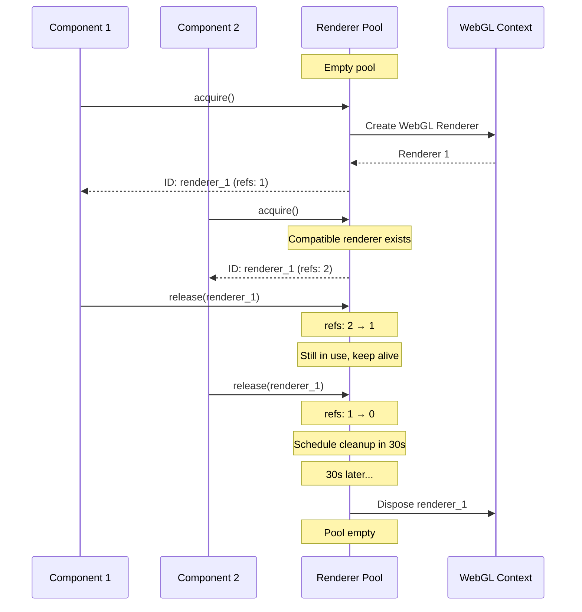

# WebGL Renderer Pooling Architecture

> **Solve "Too many active WebGL contexts" errors and reduce memory usage by 75%**

WebGL Renderer Pooling manages a shared pool of WebGL renderers across components, preventing context exhaustion and dramatically reducing memory consumption.

---

## Table of Contents

- [Overview](#overview)
- [The WebGL Context Problem](#the-webgl-context-problem)
- [Solution Architecture](#solution-architecture)
- [Implementation](#implementation)
- [Usage Patterns](#usage-patterns)
- [Performance Impact](#performance-impact)
- [Best Practices](#best-practices)
- [Troubleshooting](#troubleshooting)

---

## Overview

Modern browsers limit WebGL contexts to 8-16 concurrent instances. Asset Forge's 3D viewer components can easily exceed this limit, causing crashes and memory leaks. The Renderer Pool solves this by sharing renderers across components with intelligent reuse and reference counting.

### Key Features

- **Context Limit Management**: Stay within browser WebGL limits (4 active renderers by default)
- **Automatic Reuse**: Share compatible renderers across components
- **Reference Counting**: Safe disposal only when no components using renderer
- **Idle Cleanup**: Automatic disposal after 30s of inactivity
- **Metrics Tracking**: Monitor pool utilization and memory usage
- **Fallback Handling**: Gracefully handle pool exhaustion

### Performance Benefits

```
Without Pooling:
  - 12 viewer components = 12 WebGL contexts
  - Memory: ~600MB (50MB × 12)
  - Result: Browser crash or slowdown

With Pooling:
  - 12 viewer components = 4 shared renderers
  - Memory: ~200MB (50MB × 4)
  - Savings: 67% memory reduction
  - Result: Smooth performance
```

---

## The WebGL Context Problem

### Browser Limits

```typescript
// Browser WebGL context limits
Chrome: 16 contexts
Firefox: 16 contexts
Safari: 8 contexts
Edge: 16 contexts

// Problem in Asset Forge:
// - Asset list: 10 preview cards with 3D viewers
// - Equipment page: 4 equipment slots
// - Armor fitting: 2 comparison views
// Total: 16 viewers = Context limit exceeded!
```

### Error Symptoms

```
// Browser console errors
WARNING: Too many active WebGL contexts. Oldest context will be lost.
WebGL: CONTEXT_LOST_WEBGL
WebGL: Maximum number of contexts exceeded

// Visual symptoms:
// - Black screens in 3D viewers
// - Frozen renderers
// - Memory leaks
// - Browser slowdown
```

---

## Solution Architecture

### High-Level Design

```
┌─────────────────────────────────────────────────────┐
│            Application Layer (12 components)         │
├─────────────────────────────────────────────────────┤
│  Viewer 1  │  Viewer 2  │  ...  │  Viewer 12        │
│     ↓           ↓               ↓                    │
│  acquire()  acquire()  ...  acquire()                │
└─────┼───────────┼──────────────┼─────────────────────┘
      │           │              │
      └───────────┼──────────────┘
                  ↓
     ┌────────────────────────────┐
     │   WebGLRendererPool        │
     │   Max: 4 renderers         │
     ├────────────────────────────┤
     │  Renderer 1 (refs: 3)      │ ← Shared by viewers 1,2,3
     │  Renderer 2 (refs: 4)      │ ← Shared by viewers 4,5,6,7
     │  Renderer 3 (refs: 3)      │ ← Shared by viewers 8,9,10
     │  Renderer 4 (refs: 2)      │ ← Shared by viewers 11,12
     └────────────────────────────┘
            ↓
     WebGL Context (4 active)
```

### Reference Counting Flow



---

## Implementation

### Core Service

**Location:** `src/services/WebGLRendererPool.ts`

```typescript
import { createLogger } from '../utils/logger'
import { WebGLRenderer } from 'three'

const logger = createLogger('WebGLRendererPool')

interface RendererEntry {
  id: string
  renderer: WebGLRenderer
  refCount: number
  lastUsed: number
  options: RendererOptions
  cleanupTimer: ReturnType<typeof setTimeout> | null
}

export class WebGLRendererPool {
  private renderers: Map<string, RendererEntry> = new Map()
  private readonly maxRenderers = 4
  private readonly idleTimeout = 30000 // 30 seconds

  /**
   * Acquire a renderer from the pool
   */
  acquire(options: RendererOptions = {}): string {
    // Try to reuse compatible renderer
    const compatibleId = this.findCompatibleRenderer(options)

    if (compatibleId) {
      const entry = this.renderers.get(compatibleId)!
      entry.refCount++
      entry.lastUsed = Date.now()

      // Cancel cleanup timer
      if (entry.cleanupTimer) {
        clearTimeout(entry.cleanupTimer)
        entry.cleanupTimer = null
      }

      logger.debug(`Reusing renderer ${compatibleId} (refCount: ${entry.refCount})`)
      return compatibleId
    }

    // Create new if under limit
    if (this.renderers.size < this.maxRenderers) {
      return this.createRenderer(options)
    }

    // Pool exhausted - reclaim idle renderer
    const reclaimedId = this.reclaimIdleRenderer()
    if (reclaimedId) {
      logger.warn(`Pool exhausted, reclaiming idle renderer`)
      this.disposeRenderer(reclaimedId)
      return this.createRenderer(options)
    }

    // Fallback: create temporary renderer
    logger.error(`Pool exhausted, creating temporary renderer`)
    return this.createRenderer(options)
  }

  /**
   * Release renderer back to pool
   */
  release(id: string): void {
    const entry = this.renderers.get(id)
    if (!entry) {
      logger.warn(`Unknown renderer: ${id}`)
      return
    }

    entry.refCount = Math.max(0, entry.refCount - 1)
    entry.lastUsed = Date.now()

    // Schedule cleanup if idle
    if (entry.refCount === 0 && !entry.cleanupTimer) {
      entry.cleanupTimer = setTimeout(() => {
        this.cleanupRenderer(id)
      }, this.idleTimeout)

      logger.debug(`Scheduled cleanup for ${id} in ${this.idleTimeout}ms`)
    }
  }

  /**
   * Get renderer instance
   */
  getRenderer(id: string): WebGLRenderer | null {
    return this.renderers.get(id)?.renderer || null
  }

  private createRenderer(options: RendererOptions): string {
    const id = `renderer_${Date.now()}_${Math.random().toString(36).substr(2, 9)}`

    const renderer = new WebGLRenderer({
      antialias: options.antialias !== false,
      alpha: options.alpha !== false,
      powerPreference: 'high-performance'
    })

    renderer.setSize(options.width || 800, options.height || 600)
    renderer.setPixelRatio(Math.min(window.devicePixelRatio, 2))

    this.renderers.set(id, {
      id,
      renderer,
      refCount: 1,
      lastUsed: Date.now(),
      options,
      cleanupTimer: null
    })

    logger.debug(`Created renderer ${id} (pool: ${this.renderers.size}/${this.maxRenderers})`)
    return id
  }

  private findCompatibleRenderer(options: RendererOptions): string | null {
    for (const [id, entry] of this.renderers.entries()) {
      if (entry.refCount === 0 && this.optionsMatch(entry.options, options)) {
        return id
      }
    }
    return null
  }

  private cleanupRenderer(id: string): void {
    const entry = this.renderers.get(id)
    if (entry && entry.refCount === 0) {
      logger.debug(`Cleaning up idle renderer ${id}`)
      this.disposeRenderer(id)
      this.renderers.delete(id)
    }
  }

  private disposeRenderer(id: string): void {
    const entry = this.renderers.get(id)
    if (entry) {
      entry.renderer.dispose()
      if (entry.renderer.domElement.parentNode) {
        entry.renderer.domElement.parentNode.removeChild(entry.renderer.domElement)
      }
    }
  }
}

// Singleton
export const getRendererPool = (() => {
  let instance: WebGLRendererPool | null = null
  return () => {
    if (!instance) {
      instance = new WebGLRendererPool()
    }
    return instance
  }
})()
```

---

## Usage Patterns

### Pattern 1: React Hook Integration

```typescript
// src/hooks/useRendererPool.ts
import { useEffect, useState, useRef } from 'react'
import { getRendererPool } from '@/services/WebGLRendererPool'

export function useRendererPool(options?: RendererOptions) {
  const [rendererId, setRendererId] = useState<string | null>(null)
  const pool = useRef(getRendererPool())

  useEffect(() => {
    // Acquire renderer on mount
    const id = pool.current.acquire(options)
    setRendererId(id)

    // Release on unmount
    return () => {
      pool.current.release(id)
    }
  }, []) // Only run once

  return {
    rendererId,
    renderer: rendererId ? pool.current.getRenderer(rendererId) : null
  }
}
```

### Pattern 2: ThreeViewer Component

```typescript
// src/components/shared/ThreeViewer.tsx
import { useRendererPool } from '@/hooks/useRendererPool'
import { useEffect, useRef } from 'react'

export function ThreeViewer({ modelUrl }: { modelUrl: string }) {
  const containerRef = useRef<HTMLDivElement>(null)
  const { renderer, rendererId } = useRendererPool({
    antialias: true,
    alpha: true
  })

  useEffect(() => {
    if (!renderer || !containerRef.current) return

    // Attach renderer to DOM
    containerRef.current.appendChild(renderer.domElement)

    // Setup scene, camera, etc.
    const scene = new THREE.Scene()
    const camera = new THREE.PerspectiveCamera(75, 1, 0.1, 1000)

    // Animation loop
    function animate() {
      renderer.render(scene, camera)
      requestAnimationFrame(animate)
    }
    animate()

    return () => {
      // Renderer will be released by useRendererPool hook
      if (renderer.domElement.parentNode === containerRef.current) {
        containerRef.current?.removeChild(renderer.domElement)
      }
    }
  }, [renderer])

  return <div ref={containerRef} className="three-viewer" />
}
```

### Pattern 3: Manual Pool Management

```typescript
// Advanced usage with manual control
import { getRendererPool } from '@/services/WebGLRendererPool'

class AssetPreviewManager {
  private rendererId: string | null = null
  private pool = getRendererPool()

  async initialize() {
    this.rendererId = this.pool.acquire({
      antialias: true,
      width: 512,
      height: 512
    })
  }

  render(scene: THREE.Scene, camera: THREE.Camera) {
    if (this.rendererId) {
      this.pool.render(this.rendererId, scene, camera)
    }
  }

  dispose() {
    if (this.rendererId) {
      this.pool.release(this.rendererId)
      this.rendererId = null
    }
  }
}
```

---

## Performance Impact

### Memory Reduction

```typescript
// Before Pooling (12 viewers)
Memory Usage:
  - WebGL Context 1: 50MB
  - WebGL Context 2: 50MB
  - ...
  - WebGL Context 12: 50MB
  Total: 600MB

// After Pooling (12 viewers, 4 renderers)
Memory Usage:
  - Renderer 1 (shared): 50MB
  - Renderer 2 (shared): 50MB
  - Renderer 3 (shared): 50MB
  - Renderer 4 (shared): 50MB
  Total: 200MB

Savings: 400MB (67% reduction)
```

### Pool Metrics

```typescript
const metrics = pool.getMetrics()

// Typical metrics during session
{
  activeCount: 4,           // 4 renderers in use
  totalCreated: 6,          // Created 6 over lifetime
  totalReleased: 2,         // Released 2
  totalDisposed: 2,         // Disposed 2 idle renderers
  poolUtilization: 100,     // 4/4 = 100% utilization
  memoryEstimateMB: 200     // ~200MB total
}
```

---

## Best Practices

### ✅ Do

```typescript
// 1. Always release renderers
useEffect(() => {
  const id = pool.acquire()
  return () => pool.release(id) // IMPORTANT
}, [])

// 2. Use useRendererPool hook
const { renderer } = useRendererPool({ antialias: true })

// 3. Share renderer across similar components
// All asset previews can share same renderer options

// 4. Monitor pool metrics in development
const metrics = pool.getMetrics()
console.log('Pool utilization:', metrics.poolUtilization)
```

### ❌ Don't

```typescript
// 1. Don't create renderers manually
// ❌ BAD
const renderer = new THREE.WebGLRenderer()

// ✅ GOOD
const id = pool.acquire()
const renderer = pool.getRenderer(id)

// 2. Don't forget to release
// ❌ BAD: Memory leak
const id = pool.acquire()
// ... no release() call

// 3. Don't acquire without releasing
// ❌ BAD: Leaks references
useEffect(() => {
  const id = pool.acquire()
  // Missing cleanup!
}, [])

// 4. Don't dispose manually
// ❌ BAD: Pool manages disposal
const renderer = pool.getRenderer(id)
renderer.dispose() // Let pool handle this!
```

---

## Troubleshooting

### Issue: "Too many active WebGL contexts"

**Cause:** Components not releasing renderers

**Solution:**
```typescript
// Check all useEffect hooks have cleanup
useEffect(() => {
  const id = pool.acquire()
  return () => pool.release(id) // ← Must have this!
}, [])
```

### Issue: Black screens in 3D viewers

**Cause:** Renderer disposed while still in use

**Solution:**
```typescript
// Check reference counting
const metrics = pool.getMetrics()
console.log('Active renderers:', metrics.activeCount)

// Ensure components properly manage lifecycle
```

### Issue: Memory not decreasing

**Cause:** Idle timeout not triggering cleanup

**Solution:**
```typescript
// Force cleanup of idle renderers
pool.cleanupIdleRenderers()

// Or adjust idle timeout
new WebGLRendererPool({
  idleTimeout: 10000 // 10 seconds instead of 30
})
```

### Debug Pool State

```typescript
// Log pool state
function debugPool() {
  const pool = getRendererPool()
  const metrics = pool.getMetrics()

  console.group('Renderer Pool Debug')
  console.log('Active:', metrics.activeCount)
  console.log('Total created:', metrics.totalCreated)
  console.log('Memory:', metrics.memoryEstimateMB, 'MB')
  console.log('Utilization:', metrics.poolUtilization, '%')
  console.groupEnd()
}

// Call periodically
setInterval(debugPool, 5000)
```

---

## Related Documentation

- [Performance Architecture](./performance-architecture.md) - Overall performance strategy
- [Optimization Patterns](./optimization-patterns.md) - Other optimization techniques
- [Three.js Integration](../05-frontend/three-js-integration.md) - 3D rendering guide
- [Custom Hooks](../12-api-reference/hooks-reference.md) - useRendererPool reference

---

**Last Updated:** 2025-10-24
**Version:** 1.0.0
