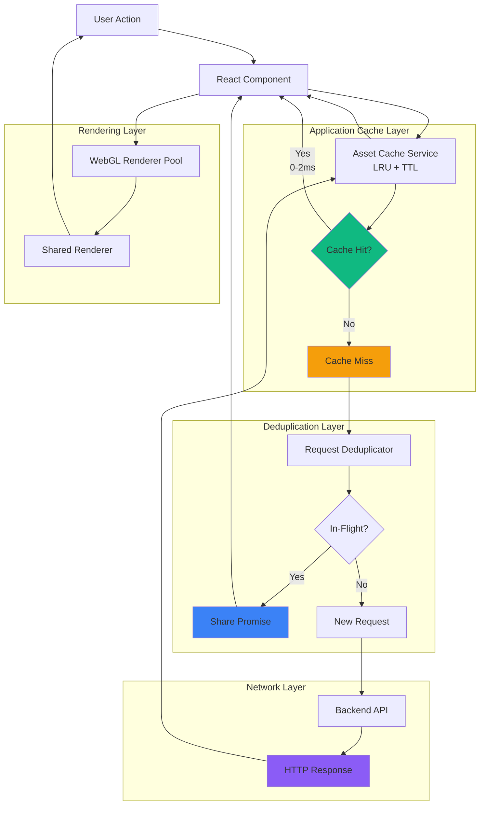
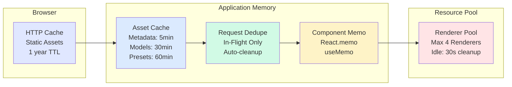
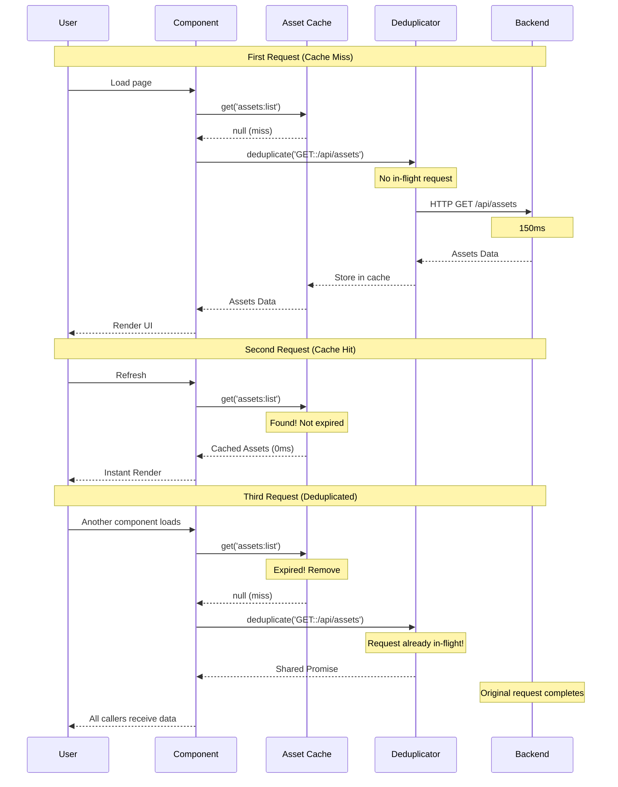
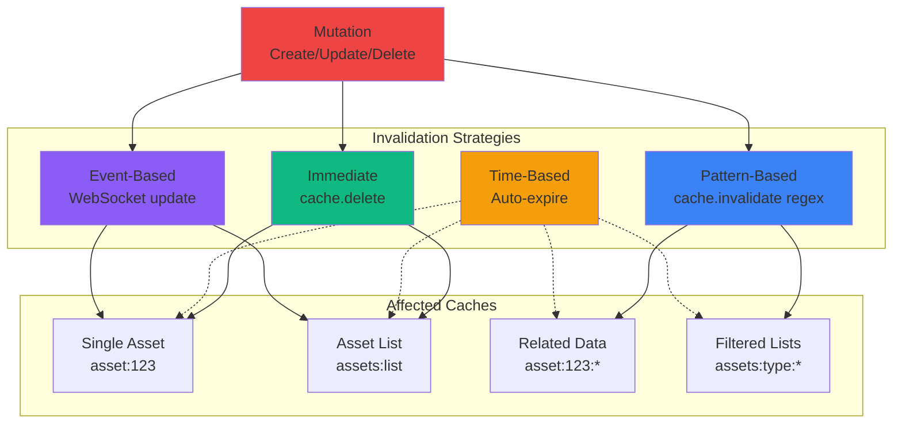
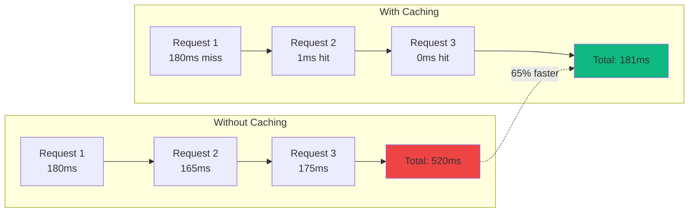
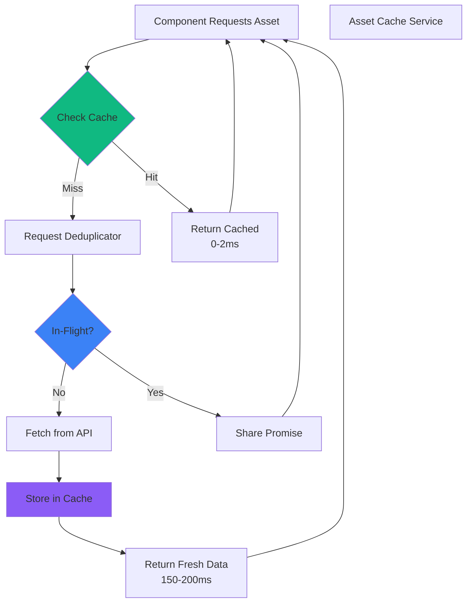
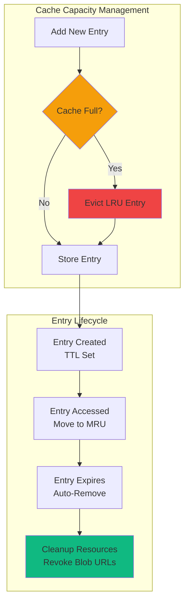

# Caching Flow Diagram

> **Visual representation of the multi-layer caching architecture**

This diagram illustrates how requests flow through Asset Forge's caching layers.

---

## Complete Caching Flow



---

## Detailed Cache Hierarchy



---

## Request Flow Timeline



---

## Cache Invalidation Patterns



---

## Performance Impact



---

## Cache Coordination Example



---

## Memory Management



---

## Usage Example

```typescript
// Complete cache flow in a component
function AssetList() {
  const [assets, setAssets] = useState<Asset[]>([])
  const cache = AssetCacheService.getInstance()

  useEffect(() => {
    async function loadAssets() {
      const cacheKey = 'assets:list'

      // 1. Check cache
      const cached = cache.get<Asset[]>(cacheKey)
      if (cached) {
        console.log('Cache HIT - 0ms')
        setAssets(cached)
        return
      }

      // 2. Deduplicate request
      const dedupeKey = 'GET::/api/assets'
      const data = await requestDeduplicator.deduplicate(dedupeKey, async () => {
        console.log('Cache MISS - Fetching from API')
        const response = await fetch('/api/assets')
        return response.json()
      })

      // 3. Store in cache
      cache.set(cacheKey, data, 'metadata') // 5min TTL
      setAssets(data)
    }

    loadAssets()
  }, [])

  return <div>{assets.map(a => <AssetCard key={a.id} asset={a} />)}</div>
}
```

---

## Related Documentation

- [Request Deduplication](../04-architecture/request-deduplication.md)
- [Asset Caching](../04-architecture/asset-caching.md)
- [Caching Strategy](../04-architecture/caching-strategy.md)
- [Performance Architecture](../04-architecture/performance-architecture.md)

---

**Last Updated:** 2025-10-24
**Version:** 1.0.0
