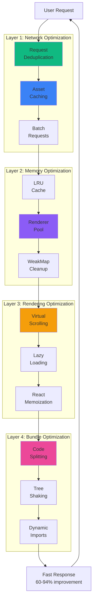
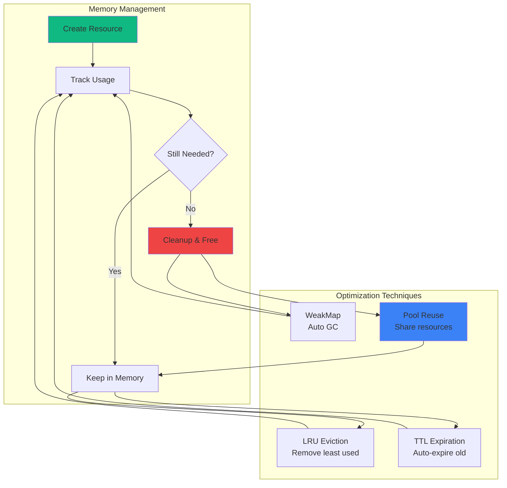
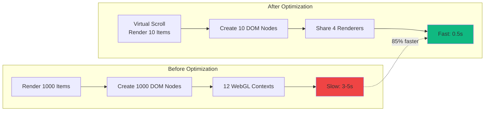
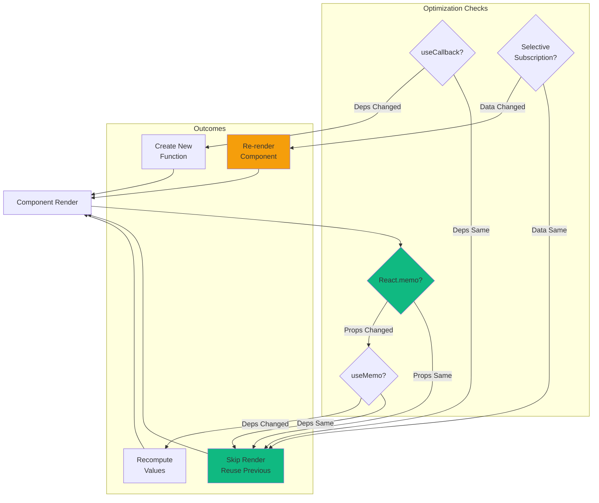
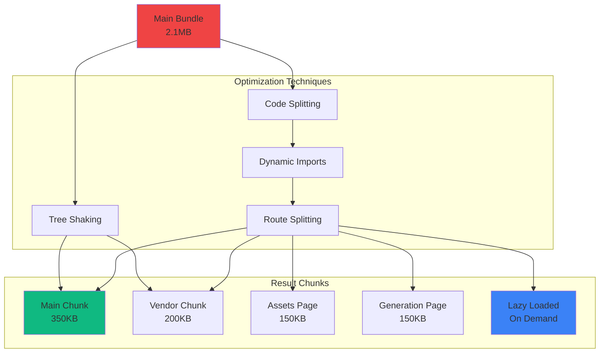
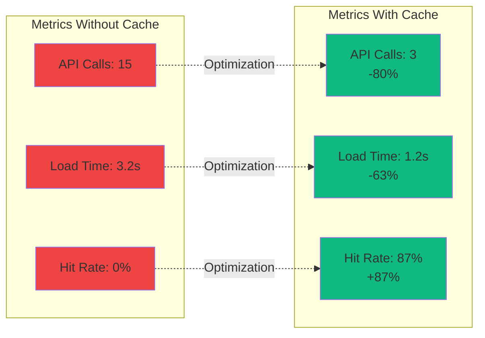
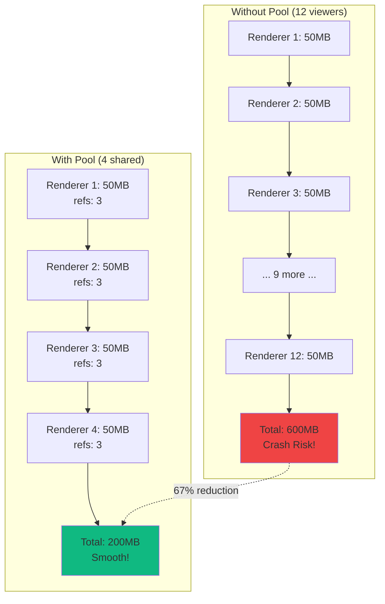
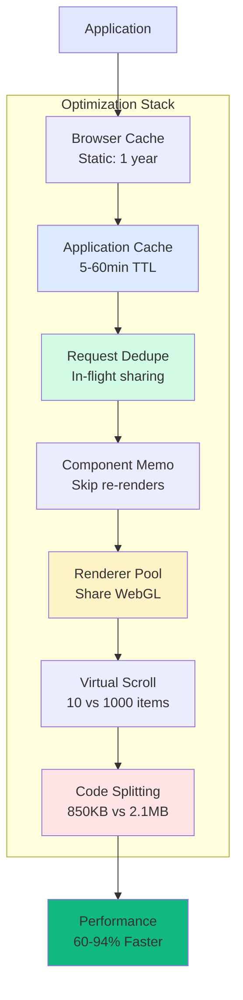

# Optimization Pipeline Diagram

> **Visual representation of performance optimizations throughout the application**

This diagram shows how various optimization techniques work together to improve performance.

---

## Complete Optimization Pipeline



---

## Request Optimization Flow

```mermaid
sequenceDiagram
    participant C1 as Component 1
    participant C2 as Component 2
    participant C3 as Component 3
    participant Opt as Optimization Layer
    participant API as Backend

    Note over C1,API: Without Optimization

    C1->>API: Fetch Assets (180ms)
    C2->>API: Fetch Assets (180ms)
    C3->>API: Fetch Assets (180ms)
    API-->>C1: Response
    API-->>C2: Response
    API-->>C3: Response

    Note over C1,API: Total: 540ms, 3 requests

    Note over C1,API: With Optimization

    C1->>Opt: Request Assets
    C2->>Opt: Request Assets
    C3->>Opt: Request Assets

    Note over Opt: Deduplicate + Cache
    Opt->>API: Single Request (180ms)
    API-->>Opt: Response

    Opt-->>C1: Shared Data
    Opt-->>C2: Shared Data
    Opt-->>C3: Shared Data

    Note over C1,API: Total: 180ms, 1 request<br/>67% faster
```

---

## Memory Optimization Strategy



---

## Rendering Performance Pipeline



---

## Component Optimization Patterns



---

## Bundle Size Optimization



---

## Cache Performance Impact



---

## WebGL Renderer Pool Impact



---

## Data Loading Optimization

```mermaid
sequenceDiagram
    participant UI as User Interface
    participant Opt as Optimizer
    participant API1 as Assets API
    participant API2 as Presets API
    participant API3 as Manifests API

    Note over UI,API3: Sequential Loading (600ms)

    UI->>API1: Fetch (200ms)
    API1-->>UI: Assets
    UI->>API2: Fetch (200ms)
    API2-->>UI: Presets
    UI->>API3: Fetch (200ms)
    API3-->>UI: Manifests

    Note over UI,API3: Parallel Loading (200ms)

    UI->>Opt: Load All Data

    par Parallel Requests
        Opt->>API1: Fetch
        Opt->>API2: Fetch
        Opt->>API3: Fetch
    end

    API1-->>Opt: Assets
    API2-->>Opt: Presets
    API3-->>Opt: Manifests

    Opt-->>UI: All Data Together

    Note over UI,API3: 67% Faster!
```

---

## Complete Performance Stack



---

## Related Documentation

- [Performance Architecture](../04-architecture/performance-architecture.md)
- [Optimization Patterns](../04-architecture/optimization-patterns.md)
- [Request Deduplication](../04-architecture/request-deduplication.md)
- [Asset Caching](../04-architecture/asset-caching.md)
- [Renderer Pooling](../04-architecture/renderer-pooling.md)

---

**Last Updated:** 2025-10-24
**Version:** 1.0.0
