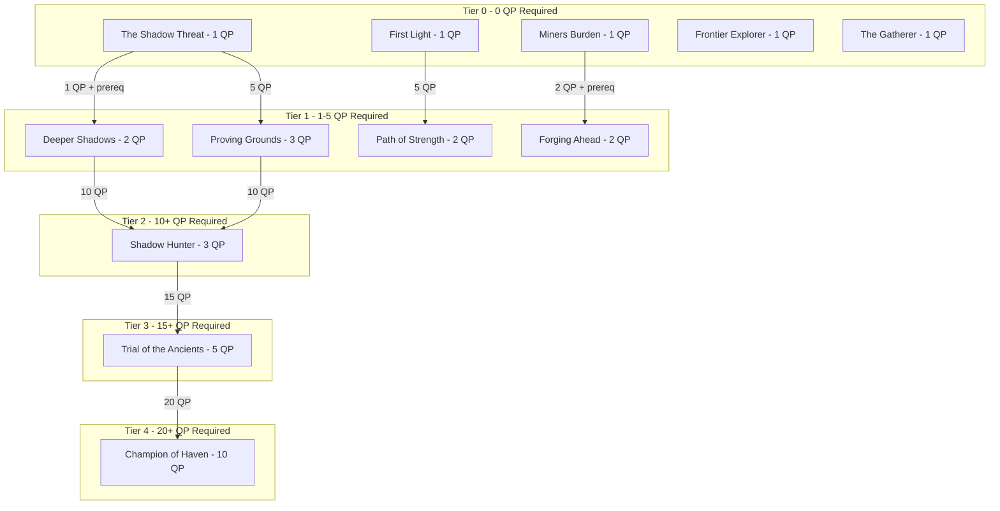

# Hyperscape Quest Lineup Design

## Overview

Original quest lineup for Hyperscape with unique Hyperscape lore and themes. The world centers around **Haven** (starter town), with dangers in **The Wastes** and mysterious **Shadow Caves**.

**IMPORTANT: Designed within actual game constraints - see Technical Constraints section.**

## Technical Constraints (Based on Code Audit)

### What Exists:
- **Quest Stage Types:** `dialogue`, `kill`, `gather`, `travel`, `interact`
- **Current NPCs:** `sentinel_marcus`, `goblin` (lv2 mob), `shadow_crawler` (lv8 mob)
- **Skills:** attack, strength, defence, ranged, prayer, magic, cooking, woodcutting, fishing, firemaking, mining, smithing, etc.
- **Gather targets:** Items from woodcutting, fishing, mining (must match item IDs in game)
- **Interact targets:** fire, cooked items, smelted bars, smithed items

### What Does NOT Exist:
- ❌ Sailing/boat travel
- ❌ Area access blocking based on quest completion
- ❌ NPC inventory checking (can't verify player has items)
- ❌ Quest branching (Phoenix Gang vs Black Arm)
- ❌ Most NPCs from original plan need to be CREATED

### Implementation Requirements:
1. New NPCs must be added to `npcs.json` with full structure
2. New mobs must be added to `npcs.json` with combat stats
3. Quest NPCs need dialogue trees with questOverrides
4. All quest names must be ORIGINAL (no RuneScape references)

---

## Quest Points System

Total Quest Points: **32** (milestone for legendary quest)

| # | Quest | Difficulty | QP | Required QP | Stages |
|---|-------|------------|---:|------------:|--------|
| 1 | The Shadow Threat | Novice | 1 | 0 | dialogue → kill 10 goblins → dialogue |
| 2 | Deeper Shadows | Intermediate | 2 | 1 | dialogue → kill 5 shadow_crawlers → dialogue |
| 3 | First Light | Novice | 1 | 0 | dialogue → gather logs → interact fire → dialogue |
| 4 | The Miners Burden | Novice | 1 | 0 | dialogue → gather copper_ore → gather tin_ore → dialogue |
| 5 | Forging Ahead | Novice | 2 | 2 | dialogue → interact bronze_bar → interact bronze_sword → dialogue |
| 6 | Proving Grounds | Intermediate | 3 | 5 | dialogue → kill 15 goblins → kill 3 shadow_crawlers → dialogue |
| 7 | Frontier Explorer | Novice | 1 | 0 | dialogue → travel wastes → travel shadow_caves → dialogue |
| 8 | The Gatherer | Novice | 1 | 0 | dialogue → gather raw_shrimp → gather cooked_shrimp → dialogue |
| 9 | Path of Strength | Intermediate | 2 | 5 | dialogue → kill 20 goblins → dialogue |
| 10 | Shadow Hunter | Experienced | 3 | 10 | dialogue → kill 10 shadow_crawlers → dialogue |
| 11 | Trial of the Ancients | Experienced | 5 | 15 | dialogue → travel → kill → gather → interact → dialogue |
| 12 | **Champion of Haven** | Master | 10 | **20** | dialogue → kill 25 goblins → kill 15 shadow_crawlers → travel → dialogue |

**Total: 32 Quest Points**

### Quest Progression Path
```
Tier 0 (0 QP): The Shadow Threat, First Light, Miners Burden, Frontier Explorer, The Gatherer
     ↓
Tier 1 (1-5 QP): Deeper Shadows, Forging Ahead → Proving Grounds, Path of Strength
     ↓
Tier 2 (10 QP): Shadow Hunter
     ↓
Tier 3 (15 QP): Trial of the Ancients
     ↓
Tier 4 (20 QP): Champion of Haven (LEGENDARY)
```

---

## Quest Descriptions (Implementable)

### Tier 0: Starter Quests (0 QP Required)

#### 1. The Shadow Threat (Already Implemented)
**NPC:** sentinel_marcus | **Difficulty:** Novice | **QP:** 1

> Goblins have been raiding Haven's supply lines. Help Sentinel Marcus deal with the threat.

**Stages:**
1. `dialogue` - Talk to Sentinel Marcus
2. `kill` - Defeat 10 Goblins (target: "goblin", count: 10)
3. `dialogue` - Return to Sentinel Marcus

**Rewards:** 1 QP, 250 Attack XP, 250 Strength XP, 500 coins, bronze_sword

---

#### 2. First Light
**NPC:** mentor_elara (NEW - must create) | **Difficulty:** Novice | **QP:** 1

> Learn the basics of survival - gathering wood and making fire.

**Stages:**
1. `dialogue` - Talk to Mentor Elara
2. `gather` - Gather 5 Logs (target: "logs", count: 5)
3. `interact` - Light 3 Fires (target: "fire", count: 3)
4. `dialogue` - Return to Mentor Elara

**Rewards:** 1 QP, 150 Woodcutting XP, 150 Firemaking XP, bronze_axe, tinderbox

---

#### 3. The Miners Burden
**NPC:** foreman_grimjaw (NEW - must create) | **Difficulty:** Novice | **QP:** 1

> The mines need more ore. Help Foreman Grimjaw meet the quota.

**Stages:**
1. `dialogue` - Talk to Foreman Grimjaw
2. `gather` - Mine 5 Copper Ore (target: "copper_ore", count: 5)
3. `gather` - Mine 5 Tin Ore (target: "tin_ore", count: 5)
4. `dialogue` - Return to Foreman Grimjaw

**Rewards:** 1 QP, 200 Mining XP, bronze_pickaxe, 300 coins

---

#### 4. Frontier Explorer
**NPC:** scout_vex (NEW - must create) | **Difficulty:** Novice | **QP:** 1

> Scout Vex needs someone to survey the dangerous areas around Haven.

**Stages:**
1. `dialogue` - Talk to Scout Vex
2. `travel` - Explore The Wastes (location: 65, 0, 0, radius: 15)
3. `travel` - Explore Shadow Caves entrance (location: 0, -10, -130, radius: 20)
4. `dialogue` - Return to Scout Vex

**Rewards:** 1 QP, 100 Agility XP, explorer_map, 200 coins

---

#### 5. The Gatherer
**NPC:** chef_helena (NEW - must create) | **Difficulty:** Novice | **QP:** 1

> Chef Helena needs fresh ingredients for the tavern.

**Stages:**
1. `dialogue` - Talk to Chef Helena
2. `gather` - Catch 5 Raw Shrimp (target: "raw_shrimp", count: 5)
3. `interact` - Cook 5 Shrimp (target: "cooked_shrimp", count: 5)
4. `dialogue` - Return to Chef Helena

**Rewards:** 1 QP, 150 Fishing XP, 150 Cooking XP, 250 coins

---

### Tier 1: Intermediate Quests (1-10 QP Required)

#### 6. Deeper Shadows (Already Implemented)
**NPC:** sentinel_marcus | **Difficulty:** Intermediate | **QP:** 2 | **Requires:** 1 QP + the_shadow_threat

> The goblins were just puppets. Something darker lurks in the caves.

**Stages:**
1. `dialogue` - Talk to Sentinel Marcus
2. `kill` - Defeat 5 Shadow Crawlers (target: "shadow_crawler", count: 5)
3. `dialogue` - Return to Sentinel Marcus

**Rewards:** 2 QP, 500 Attack XP, 500 Strength XP, 250 Defence XP, iron_sword, 1000 coins

---

#### 7. Forging Ahead
**NPC:** foreman_grimjaw | **Difficulty:** Novice | **QP:** 2 | **Requires:** 2 QP + the_miners_burden

> Grimjaw wants you to learn the art of smithing.

**Stages:**
1. `dialogue` - Talk to Foreman Grimjaw
2. `interact` - Smelt 3 Bronze Bars (target: "bronze_bar", count: 3)
3. `interact` - Smith 1 Bronze Sword (target: "bronze_sword", count: 1)
4. `dialogue` - Return to Foreman Grimjaw

**Rewards:** 2 QP, 200 Mining XP, 300 Smithing XP, 500 coins

---

#### 8. Proving Grounds
**NPC:** sentinel_marcus | **Difficulty:** Intermediate | **QP:** 3 | **Requires:** 5 QP

> Sentinel Marcus wants to test your combat prowess against larger forces.

**Stages:**
1. `dialogue` - Talk to Sentinel Marcus
2. `kill` - Defeat 15 Goblins (target: "goblin", count: 15)
3. `kill` - Defeat 3 Shadow Crawlers (target: "shadow_crawler", count: 3)
4. `dialogue` - Return to Sentinel Marcus

**Rewards:** 3 QP, 500 Attack XP, 500 Strength XP, 500 Defence XP, steel_sword, 1500 coins

---

#### 9. Path of Strength
**NPC:** warrior_thorne (NEW - must create) | **Difficulty:** Intermediate | **QP:** 2 | **Requires:** 5 QP

> Warrior Thorne challenges you to prove your might.

**Stages:**
1. `dialogue` - Talk to Warrior Thorne
2. `kill` - Defeat 20 Goblins (target: "goblin", count: 20)
3. `dialogue` - Return to Warrior Thorne

**Rewards:** 2 QP, 800 Strength XP, 400 Attack XP, warrior_helm

---

### Tier 2: Experienced Quests (10-20 QP Required)

#### 10. Shadow Hunter
**NPC:** sentinel_marcus | **Difficulty:** Experienced | **QP:** 3 | **Requires:** 10 QP

> The Shadow Crawlers are organizing. Hunt them down before they attack Haven.

**Stages:**
1. `dialogue` - Talk to Sentinel Marcus
2. `kill` - Defeat 10 Shadow Crawlers (target: "shadow_crawler", count: 10)
3. `dialogue` - Return to Sentinel Marcus

**Rewards:** 3 QP, 1000 Attack XP, 1000 Defence XP, shadow_cloak, 2000 coins

---

#### 11. Trial of the Ancients
**NPC:** elder_sage (NEW - must create) | **Difficulty:** Experienced | **QP:** 5 | **Requires:** 15 QP

> The Elder Sage tests worthy adventurers with ancient trials.

**Stages:**
1. `dialogue` - Talk to the Elder Sage
2. `travel` - Reach the Ancient Shrine (location: -50, 10, -80, radius: 10)
3. `kill` - Defeat 8 Shadow Crawlers guarding the shrine (target: "shadow_crawler", count: 8)
4. `gather` - Collect 10 Iron Ore as tribute (target: "iron_ore", count: 10)
5. `interact` - Light the Sacred Flame (target: "fire", count: 1)
6. `dialogue` - Return to the Elder Sage

**Rewards:** 5 QP, 1500 total XP (split across combat skills), ancient_amulet, 3000 coins

---

### LEGENDARY QUEST

#### 12. Champion of Haven
**NPC:** commander_aldric (NEW - must create) | **Difficulty:** Master | **QP:** 10 | **Requires:** 20 QP

> The ultimate challenge. Prove yourself as the true Champion of Haven by facing all threats and securing the realm.

**Prerequisites:**
- 20 Quest Points minimum
- Level 20+ Attack, Strength, Defence recommended

**Stages:**
1. `dialogue` - Speak with Commander Aldric at the champions hall
2. `kill` - Defeat 25 Goblins (final cleansing)
3. `kill` - Defeat 15 Shadow Crawlers (purge the darkness)
4. `travel` - Reach the Heart of Darkness (location: 0, -15, -170, radius: 15)
5. `dialogue` - Return victorious to Commander Aldric

**Rewards:**
- 10 Quest Points (brings total to 30+)
- 3000 Attack XP, 3000 Strength XP, 3000 Defence XP
- Champion's Blade (unique weapon)
- Champion of Haven title
- 10000 coins

---

## NPCs to Create (for npcs.json)

The following NPCs need to be added to `packages/server/world/assets/manifests/npcs.json`:

### Quest Giver NPCs (category: "quest")

| ID | Name | Location | Quests |
|----|------|----------|--------|
| `sentinel_marcus` | Sentinel Marcus | Haven (0, 0, 10) | ✅ EXISTS |
| `mentor_elara` | Mentor Elara | Haven Square (5, 0, 0) | First Light |
| `foreman_grimjaw` | Foreman Grimjaw | Haven Mine (-10, 0, 5) | The Miners Burden, Forging Ahead |
| `scout_vex` | Scout Vex | Haven Gate (15, 0, 0) | Frontier Explorer |
| `chef_helena` | Chef Helena | Haven Tavern (0, 0, 15) | The Gatherer |
| `warrior_thorne` | Warrior Thorne | Haven Training (8, 0, -5) | Path of Strength |
| `elder_sage` | Elder Sage | Haven Library (-8, 0, -10) | Trial of the Ancients |
| `commander_aldric` | Commander Aldric | Champions Hall (0, 0, -20) | Champion of Haven |

---

## AssetForge NPC Generation Guide

### Prerequisites

1. **API Keys** - Configure `packages/asset-forge/.env`:
   ```bash
   cp packages/asset-forge/.env.example packages/asset-forge/.env
   # Edit and add:
   VITE_OPENAI_API_KEY=your-openai-key
   VITE_MESHY_API_KEY=your-meshy-key
   ```

2. **Start AssetForge**:
   ```bash
   bun run dev:forge
   ```
   - UI: http://localhost:3400
   - API: http://localhost:3401

### NPC Asset Specifications

Generate each NPC as a **"character"** asset type. The output GLB files should be placed in `packages/server/world/assets/npcs/`.

---

#### 1. Mentor Elara (`mentor_elara.glb`)

**Visual Concept:**
A wise, nurturing figure who teaches survival skills to new adventurers.

**AssetForge Prompt:**
> Fantasy female mentor sage, middle-aged, kind wise face with warm expression, silver-streaked long hair in a practical braid, wearing simple but elegant dark blue teaching robes with silver trim, leather belt with pouches containing scrolls and herbs, holding a wooden staff with a soft glowing crystal at the top, barefoot or simple sandals, gentle magical aura around her, low-poly stylized RPG character, full body standing pose

**Style Tags:** `fantasy`, `low-poly`, `stylized`, `rpg-character`, `npc`

**Model Path:** `npcs/mentor_elara.glb`
**Scale:** 1.0

---

#### 2. Foreman Grimjaw (`foreman_grimjaw.glb`)

**Visual Concept:**
A gruff, hardworking mining supervisor with years of experience underground.

**AssetForge Prompt:**
> Gruff dwarven mining foreman, stocky muscular build, weathered rugged face with thick braided beard containing metal clasps, protective leather work apron over sturdy brown work clothes, heavy mining boots, tool belt with hammer pickaxe and measuring tools, mining helmet with attached lantern, coal dust and sweat stains on clothes, crossed arms confident pose, low-poly stylized RPG character, full body

**Style Tags:** `fantasy`, `dwarf`, `low-poly`, `stylized`, `rpg-character`, `npc`

**Model Path:** `npcs/foreman_grimjaw.glb`
**Scale:** 0.9 (slightly shorter)

---

#### 3. Scout Vex (`scout_vex.glb`)

**Visual Concept:**
An agile, observant ranger who patrols the dangerous borders of Haven.

**AssetForge Prompt:**
> Lithe elven ranger scout, androgynous sharp features, short practical dark hair with braids, alert watchful eyes, wearing muted green-brown leather armor for stealth, hooded cloak draped over shoulders, shortbow strapped to back with quiver of arrows, belt pouches with maps and rope, light leather boots for quick movement, one hand raised in greeting, low-poly stylized RPG character, full body standing

**Style Tags:** `fantasy`, `elf`, `ranger`, `low-poly`, `stylized`, `rpg-character`, `npc`

**Model Path:** `npcs/scout_vex.glb`
**Scale:** 1.05 (slightly taller)

---

#### 4. Chef Helena (`chef_helena.glb`)

**Visual Concept:**
A friendly, rotund tavern cook who supplies adventures with hearty meals.

**AssetForge Prompt:**
> Friendly stout human female tavern chef cook, round cheerful face with rosy cheeks and warm smile, hair tied back in a neat bun covered with a white cap, wearing flour-dusted cream colored apron over simple peasant dress, wooden spoon tucked into apron pocket, carrying a steaming pot or ladle, comfortable worn leather shoes, welcoming open posture, low-poly stylized RPG character, full body

**Style Tags:** `fantasy`, `human`, `low-poly`, `stylized`, `rpg-character`, `npc`, `tavern`

**Model Path:** `npcs/chef_helena.glb`
**Scale:** 1.0

---

#### 5. Warrior Thorne (`warrior_thorne.glb`)

**Visual Concept:**
A battle-scarred veteran warrior who trains Haven's defenders.

**AssetForge Prompt:**
> Scarred veteran human warrior trainer, tall muscular athletic build, short military-cut gray hair, battle scars across face and arms, stern but fair expression, wearing well-maintained iron chainmail armor over padded cloth, leather sword belt with training sword, armored bracers and greaves, sturdy combat boots, arms crossed in evaluating stance, low-poly stylized RPG character, full body

**Style Tags:** `fantasy`, `warrior`, `human`, `low-poly`, `stylized`, `rpg-character`, `npc`

**Model Path:** `npcs/warrior_thorne.glb`
**Scale:** 1.1 (tall and imposing)

---

#### 6. Elder Sage (`elder_sage.glb`)

**Visual Concept:**
An ancient mystical scholar who guards forbidden knowledge.

**AssetForge Prompt:**
> Ancient wise elder sage mage, very old with long flowing white beard and hair, deeply wrinkled face with knowing piercing eyes, wearing elaborate dark purple arcane robes with gold mystical embroidery and symbols, holding an ancient tome or crystal orb, gnarled wooden staff at his side, pointed wizard hat optional, mystical particles floating around him, hunched slightly with age but radiating power, low-poly stylized RPG character, full body

**Style Tags:** `fantasy`, `mage`, `wizard`, `low-poly`, `stylized`, `rpg-character`, `npc`

**Model Path:** `npcs/elder_sage.glb`
**Scale:** 1.0

---

#### 7. Commander Aldric (`commander_aldric.glb`)

**Visual Concept:**
The supreme military leader of Haven's forces, a legendary hero in his own right.

**AssetForge Prompt:**
> Imposing human military commander, tall and powerfully built, strong jaw with neatly trimmed dark beard streaked with gray, stern commanding presence, wearing ornate steel plate armor with gold Haven insignia on breastplate, crimson cape flowing behind, decorated sword at hip, gauntlets removed and held in one hand, standing in heroic commanding pose, low-poly stylized RPG character, full body

**Style Tags:** `fantasy`, `knight`, `commander`, `human`, `low-poly`, `stylized`, `rpg-character`, `npc`

**Model Path:** `npcs/commander_aldric.glb`
**Scale:** 1.15 (the largest NPC, very imposing)

---

### AssetForge Generation Steps

**For Each NPC:**

1. **Open AssetForge UI**: http://localhost:3400/generation

2. **Configure Generation**:
   - Asset Type: `character`
   - Art Style: `low-poly stylized`
   - Paste the prompt from above
   - Add the style tags

3. **Generate**:
   - Click "Generate Concept Art" first to preview
   - Approve the concept or regenerate
   - Click "Generate 3D Model" to create the GLB

4. **Review Output**:
   - Assets save to `packages/asset-forge/gdd-assets/[asset-name]/`
   - Preview in the 3D viewer
   - Use retexturing if materials need adjustment

5. **Export & Move**:
   ```bash
   # Copy from gdd-assets to server assets
   cp packages/asset-forge/gdd-assets/[npc_name]/*.glb \
      packages/server/world/assets/npcs/[npc_id].glb
   ```

6. **Verify in npcs.json**:
   - Set `appearance.modelPath` to `npcs/[npc_id].glb`
   - Adjust `appearance.scale` as specified above

---

### Generation Checklist

- [ ] Mentor Elara - wise female teacher
- [ ] Foreman Grimjaw - gruff dwarven miner
- [ ] Scout Vex - agile elven ranger
- [ ] Chef Helena - friendly tavern cook
- [ ] Warrior Thorne - battle-scarred trainer
- [ ] Elder Sage - ancient mystical scholar
- [ ] Commander Aldric - imposing military leader

### Tips for Best Results

1. **Prompt Enhancement**: Let GPT-4 enhance your prompts for better Meshy results
2. **Concept Art First**: Always review the DALL-E concept before 3D generation
3. **Material Variants**: Use the retexturing feature if colors are wrong
4. **T-Pose**: Request T-pose for better animation compatibility
5. **Scale**: Set in npcs.json, not during generation

### Mobs (category: "mob")

| ID | Name | Level | Location | Exists? |
|----|------|-------|----------|---------|
| `goblin` | Goblin | 2 | Eastern Wilds, Shadow Caves | ✅ EXISTS |
| `shadow_crawler` | Shadow Crawler | 8 | Shadow Caves | ✅ EXISTS |

---

## NPC Template Structure

Each new quest NPC needs:

```json
{
  "id": "npc_id",
  "name": "NPC Display Name",
  "description": "Description text",
  "category": "quest",
  "faction": "haven",
  "stats": { "level": 1, "health": 100, ... },
  "combat": { "attackable": false, "aggressive": false, ... },
  "movement": { "type": "stationary", "speed": 0, "wanderRadius": 0 },
  "drops": { "defaultDrop": { "enabled": false }, ... },
  "services": { "enabled": true, "types": ["quest"], "questIds": ["quest_id"] },
  "behavior": { "enabled": false },
  "appearance": { "modelPath": "npcs/generic_npc.glb", "scale": 1.0 },
  "position": { "x": 0, "y": 0, "z": 0 },
  "dialogue": {
    "entryNodeId": "greeting",
    "questOverrides": { ... },
    "nodes": [ ... ]
  }
}
```

---

## Implementation Priority

### Phase 1: Use Existing NPCs (2 quests) - DONE
1. ✅ The Shadow Threat (sentinel_marcus, goblin)
2. ✅ Deeper Shadows (sentinel_marcus, shadow_crawler)

### Phase 2: Add Tutorial NPCs (4 quests)
3. First Light - Create `mentor_elara`
4. The Miners Burden - Create `foreman_grimjaw`
5. Frontier Explorer - Create `scout_vex`
6. The Gatherer - Create `chef_helena`

### Phase 3: Add Combat NPCs (3 quests)
7. Forging Ahead - Uses `foreman_grimjaw`
8. Proving Grounds - Uses `sentinel_marcus`
9. Path of Strength - Create `warrior_thorne`

### Phase 4: Add Endgame NPCs (3 quests)
10. Shadow Hunter - Uses `sentinel_marcus`
11. Trial of the Ancients - Create `elder_sage`
12. Champion of Haven - Create `commander_aldric`

**Total: 6 new NPCs to create, 12 quests total**

---

## Quest Flow Diagram


