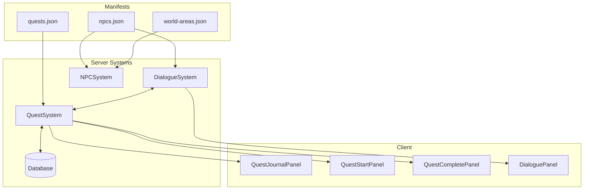
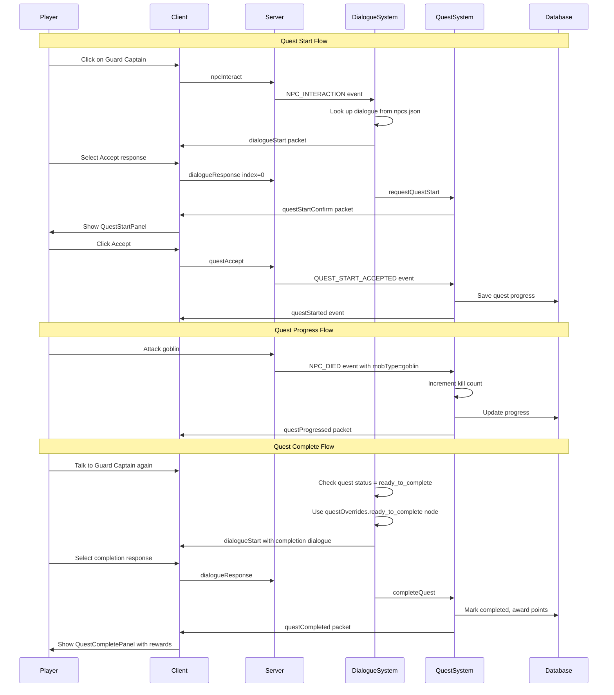

# Quest System Implementation Plan

## Executive Summary

This project already has a **complete quest system infrastructure** with ~1200 lines of server-side code, database tables, client UI components, and network handlers. However, **no actual quest content exists yet**. The system loads quests from a `quests.json` manifest file that needs to be created.

This plan outlines the steps to add your first quests to the game.

---

## Architecture Overview



---

## Implementation Steps

### Step 1: Create the Manifests Directory Structure

The manifests are stored at `packages/server/world/assets/manifests/`. This directory is created at server startup if it doesn't exist, and manifests are typically fetched from CDN. For local development, you'll need to create this manually.

```bash
mkdir -p packages/server/world/assets/manifests
```

---

### Step 2: Create `quests.json` Manifest

**IMPLEMENTED:** See `packages/server/world/assets/manifests/quests.json`

**Example Quest: "The Shadow Threat"**

```json
{
  "the_shadow_threat": {
    "id": "the_shadow_threat",
    "name": "The Shadow Threat",
    "description": "Sentinel Marcus needs help dealing with a goblin infestation threatening the outskirts of Haven.",
    "difficulty": "novice",
    "questPoints": 1,
    "replayable": false,
    "startNpc": "sentinel_marcus",
    "requirements": {
      "quests": [],
      "skills": {},
      "items": []
    },
    "stages": [
      {
        "id": "talk_to_sentinel",
        "type": "dialogue",
        "description": "Speak with Sentinel Marcus about the goblin threat",
        "npcId": "sentinel_marcus"
      },
      {
        "id": "defeat_goblins",
        "type": "kill",
        "description": "Defeat 10 Goblins threatening Haven",
        "target": "goblin",
        "count": 10
      },
      {
        "id": "return_to_sentinel",
        "type": "dialogue",
        "description": "Return to Sentinel Marcus",
        "npcId": "sentinel_marcus"
      }
    ],
    "onStart": {
      "items": [
        { "itemId": "bronze_sword", "quantity": 1 }
      ]
    },
    "rewards": {
      "questPoints": 1,
      "items": [
        { "itemId": "coins", "quantity": 500 }
      ],
      "xp": {
        "attack": 250,
        "strength": 250
      }
    }
  }
}
```

**Bonus Quest: "Deeper Shadows"** (requires completing "The Shadow Threat")
- Defeat 5 Shadow Crawlers in the Shadow Caves
- Rewards: Iron Sword, 1000 coins, combat XP

**Supported Stage Types:**
- `dialogue` - Talk to an NPC
- `kill` - Kill N of a specific mob type
- `gather` - Collect N of an item (woodcutting, mining, fishing)
- `interact` - Create N of an item (cooking, smelting, smithing, firemaking)
- `travel` - Go to a specific location

---

### Step 3: Add Quest-Giving NPC to `npcs.json`

Add or update an NPC entry in `packages/server/world/assets/manifests/npcs.json`:

```json
{
  "id": "guard_captain",
  "name": "Guard Captain",
  "description": "A seasoned veteran who protects the village",
  "category": "quest",
  "faction": "village_guards",
  "stats": {
    "level": 25,
    "health": 50,
    "attack": 20,
    "strength": 20,
    "defense": 25,
    "ranged": 1,
    "magic": 1
  },
  "combat": {
    "attackable": false,
    "aggressive": false,
    "retaliates": false,
    "aggroRange": 0,
    "combatRange": 1,
    "attackSpeedTicks": 4,
    "respawnTime": 0,
    "xpReward": 0,
    "poisonous": false,
    "immuneToPoison": true
  },
  "movement": {
    "type": "stationary",
    "speed": 0,
    "wanderRadius": 0,
    "roaming": false
  },
  "drops": {
    "defaultDrop": { "itemId": "bones", "quantity": 1, "enabled": false },
    "always": [],
    "common": [],
    "uncommon": [],
    "rare": [],
    "veryRare": [],
    "rareDropTable": false
  },
  "services": {
    "enabled": true,
    "types": ["quest"],
    "questIds": ["goblin_slayer"]
  },
  "behavior": {
    "enabled": false
  },
  "appearance": {
    "modelPath": "npcs/guard_captain.glb",
    "scale": 1.0
  },
  "position": { "x": 0, "y": 0, "z": 0 },
  "dialogue": {
    "entryNodeId": "greeting",
    "questOverrides": {
      "goblin_slayer": {
        "in_progress": "quest_in_progress",
        "ready_to_complete": "quest_complete",
        "completed": "quest_done"
      }
    },
    "nodes": [
      {
        "id": "greeting",
        "text": "Greetings, adventurer! The village is under threat from goblins. Will you help us?",
        "responses": [
          {
            "text": "I will help you deal with the goblins!",
            "nextNodeId": "quest_accept",
            "effect": "startQuest:goblin_slayer"
          },
          {
            "text": "Not right now.",
            "nextNodeId": "decline"
          }
        ]
      },
      {
        "id": "quest_accept",
        "text": "Excellent! Slay 10 goblins and return to me. Take this sword - you will need it.",
        "responses": []
      },
      {
        "id": "decline",
        "text": "Very well. Return if you change your mind.",
        "responses": []
      },
      {
        "id": "quest_in_progress",
        "text": "Have you dealt with those goblins yet? We need you to slay 10 of them.",
        "responses": [
          {
            "text": "I am working on it.",
            "nextNodeId": "encouragement"
          }
        ]
      },
      {
        "id": "encouragement",
        "text": "Good luck out there, adventurer!",
        "responses": []
      },
      {
        "id": "quest_complete",
        "text": "You have done it! The village is safe thanks to you. Here is your reward.",
        "responses": [
          {
            "text": "It was my pleasure.",
            "nextNodeId": "reward_given",
            "effect": "completeQuest:goblin_slayer"
          }
        ]
      },
      {
        "id": "reward_given",
        "text": "You are a true hero! If you ever need work, come find me.",
        "responses": []
      },
      {
        "id": "quest_done",
        "text": "The village remains peaceful thanks to your efforts!",
        "responses": [
          {
            "text": "Farewell.",
            "nextNodeId": "goodbye"
          }
        ]
      },
      {
        "id": "goodbye",
        "text": "Safe travels, hero!",
        "responses": []
      }
    ]
  }
}
```

---

### Step 4: Add NPC Spawn Location to `world-areas.json`

Add the NPC spawn to your world areas in `packages/server/world/assets/manifests/world-areas.json`:

```json
{
  "lumbridge": {
    "id": "lumbridge",
    "name": "Lumbridge",
    "type": "town",
    "bounds": {
      "center": { "x": 0, "y": 0, "z": 0 },
      "radius": 100
    },
    "npcs": [
      {
        "id": "guard_captain",
        "type": "quest_giver",
        "position": { "x": 5, "y": 0, "z": -5 }
      }
    ]
  }
}
```

---

### Step 5: Ensure Goblins Exist in NPC Manifest

For the kill quest to work, you need goblins defined in `npcs.json` with `category: "mob"`:

```json
{
  "id": "goblin",
  "name": "Goblin",
  "description": "A small green creature with a bad temper",
  "category": "mob",
  "stats": {
    "level": 2,
    "health": 10,
    "attack": 2,
    "strength": 2,
    "defense": 1,
    "ranged": 1,
    "magic": 1
  },
  "combat": {
    "attackable": true,
    "aggressive": true,
    "retaliates": true,
    "aggroRange": 5,
    "combatRange": 1,
    "attackSpeedTicks": 4,
    "respawnTicks": 50,
    "respawnTime": 30000,
    "xpReward": 25,
    "poisonous": false,
    "immuneToPoison": false
  }
}
```

---

## Quest Flow Diagram



---

## Testing the Implementation

### 1. Start the Server
```bash
bun run dev
```

### 2. Verify Manifests Load
Check server logs for:
```
[QuestSystem] Loaded X quest definitions from .../quests.json
```

### 3. Test Quest Flow
1. Create a character and spawn in the world
2. Find and talk to the Guard Captain NPC
3. Accept the quest - verify bronze sword is received
4. Open Quest Journal - verify quest appears as "In Progress"
5. Kill 10 goblins - watch for progress messages in chat
6. Return to Guard Captain - dialogue should offer completion
7. Complete quest - verify rewards received

### 4. Database Verification
Check the `quest_progress` table:
```sql
SELECT * FROM quest_progress WHERE playerId = 'your-player-id';
```

---

## File Summary

| File | Purpose |
|------|---------|
| `packages/server/world/assets/manifests/quests.json` | Quest definitions |
| `packages/server/world/assets/manifests/npcs.json` | NPC definitions with dialogue trees |
| `packages/server/world/assets/manifests/world-areas.json` | NPC spawn locations |
| `packages/shared/src/systems/shared/progression/QuestSystem.ts` | Server quest logic (exists) |
| `packages/shared/src/systems/shared/interaction/DialogueSystem.ts` | Dialogue processing (exists) |
| `packages/client/src/game/panels/QuestJournalPanel.tsx` | Quest UI (exists) |

---

## Common Issues

### Quest Not Loading
- Check server logs for validation errors
- Ensure quest ID matches between quests.json and dialogue effect

### NPC Not Appearing
- Verify NPC is in npcs.json with matching ID
- Verify spawn location in world-areas.json
- Check NPC category matches world-area type

### Dialogue Not Working
- Verify dialogue tree has valid entryNodeId
- Check questOverrides quest IDs match quests.json
- Ensure node IDs in responses match existing nodes

### Kills Not Counting
- Verify mob type matches `target` field in kill stage
- Check that mobs are spawning (category: "mob" in npcs.json)
- Verify NPC_DIED event includes correct mobType

---

## Next Steps

After implementing basic quests, consider:
1. Adding more stage types (gather, interact, travel)
2. Creating quest chains with prerequisites
3. Adding skill requirements
4. Implementing timed quests
5. Adding XP lamp rewards
6. Creating quest guides/hints UI
